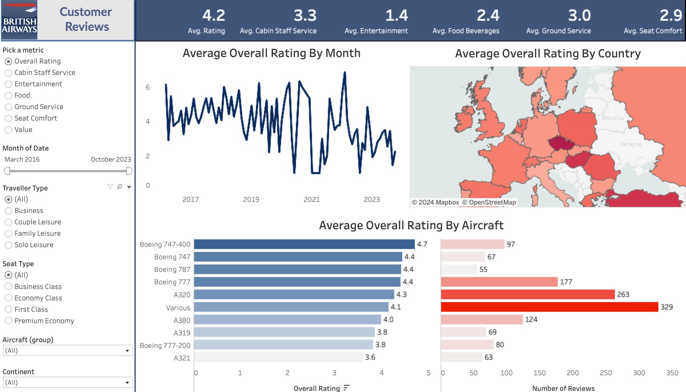

# British Airways Customer Reviews from 2016 to 2023

"According to a survey by Phocuswright, 83% of travelers say reviews are important to their travel decision-making process, highlighting the need for British Airways to analyse customer feedback from 2016 to 2023 to enhance service quality and customer satisfaction."

